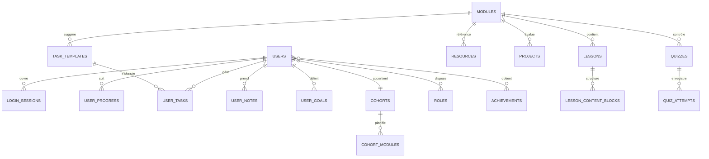

# Modèle de données proposé pour CodingLearn

## Contexte actuel

L'authentification et la persistance des données dans l'application front-end reposent aujourd'hui exclusivement sur le `localStorage` du navigateur. Les fonctions `loadUsers`, `persistUsers` et `persistActiveUser` lisent et écrivent les informations d'utilisateur dans les clés `codinglearn:users` et `codinglearn:active-user`, sans faire appel à un service externe ou à une base de données.

Cette approche fonctionne pour un prototype, mais elle ne couvre pas les besoins de sécurité, de scalabilité et de collaboration multi-appareils. Une base de données relationnelle centralisée est recommandée pour une évolution durable.

## Principes de conception

- **Sécurité** : stockage des mots de passe hachés, historique des connexions, rôles et permissions.
- **Évolutivité** : tables normalisées, clés étrangères explicites, colonnes `created_at` / `updated_at`, prise en charge du soft delete.
- **Observabilité** : journalisation des actions pédagogiques (progression, tâches, notes).
- **Flexibilité pédagogique** : modélisation des cohortes, modules, leçons et ressources afin de pouvoir enrichir le catalogue.

## Schéma relationnel



### Table `users`

| Colonne           | Type              | Contraintes / Description                                  |
|-------------------|-------------------|-------------------------------------------------------------|
| `id`              | uuid              | PK                                                          |
| `email`           | citext            | UNIQUE, non nul                                             |
| `password_hash`   | text              | Hachage Argon2 / bcrypt                                    |
| `full_name`       | text              | non nul                                                    |
| `preferred_locale`| text              | défaut `fr-FR`                                             |
| `avatar_url`      | text              | nullable                                                   |
| `cohort_id`       | uuid              | FK → `cohorts.id`, nullable                               |
| `streak_count`    | integer           | défaut `0`                                                  |
| `last_login_at`   | timestamptz       |                                                             |
| `previous_login_at`| timestamptz      |                                                             |
| `created_at`      | timestamptz       | défaut `now()`                                              |
| `updated_at`      | timestamptz       | défaut `now()`                                              |
| `deleted_at`      | timestamptz       | nullable (soft delete)                                      |

### Table `roles` & `user_roles`

- `roles` : catalogue (`id`, `code`, `label`, `description`).
- `user_roles` : association (`user_id`, `role_id`, `granted_at`). Permet d'ajouter des rôles multiples (apprenant·e, mentor, admin, etc.).

### Table `login_sessions`

Historise les connexions pour des mesures de sécurité et pour calculer les streaks.

| Colonne        | Type        | Description                                |
|----------------|-------------|--------------------------------------------|
| `id`           | uuid        | PK                                         |
| `user_id`      | uuid        | FK → `users.id`                            |
| `ip_address`   | inet        |                                            |
| `user_agent`   | text        |                                            |
| `logged_in_at` | timestamptz |                                            |
| `logged_out_at`| timestamptz | nullable                                   |

### Table `cohorts`

Décrit les sessions de formation (dates, niveau, encadrant·e principal·e, canal de communication).

### Table `modules`, `lessons`, `lesson_content_blocks`

Permet de structurer le programme pédagogique avec granularité fine (textes, vidéos, quiz, liens externes).

### Table `resources`

Référence bibliographie, tutoriels, replays. Champs : `module_id`, `title`, `resource_type`, `url`, `estimated_duration`, `description`.

### Table `projects`

Décrit les projets pratiques à livrer (barème, compétences travaillées, dates cibles). S'articule avec des remises et feedbacks (`project_submissions`, `project_reviews`).

### Table `quizzes` & `quiz_attempts`

Gestion des évaluations formatives. `quiz_attempts` stocke la copie (`answers` JSONB, `score`, `submitted_at`).

### Table `task_templates`, `user_tasks`

- `task_templates` : tâches par défaut associées à un module ou à une cohorte.
- `user_tasks` : instance personnalisée pour un utilisateur (`label`, `category`, `is_locked`, `completed_at`, `due_at`).

### Table `user_goals`

Conserve l'historique des objectifs d'apprentissage, avec les colonnes `focus`, `hours_per_week`, `next_checkpoint`, `effective_from`, `effective_to`.

### Table `user_progress`

Stocke l'état d'avancement par module (`status` enum `not_started` / `in_progress` / `completed`, `last_changed_at`).

### Table `user_notes`

`id`, `user_id`, `module_id` nullable, `content`, `created_at`, `updated_at`. Permet d'écrire des notes contextualisées.

### Table `achievements` & `user_achievements`

Soutient un système de badges. `achievements` définit les badges, `user_achievements` associe un utilisateur avec `earned_at` et métadonnées (`evidence_url`).

### Table `notifications`

Gestion d'in-app notifications ou emails planifiés (`type`, `payload` JSONB, `scheduled_at`, `sent_at`).

## Exemples de migrations (PostgreSQL)

```sql
CREATE TABLE users (
  id uuid PRIMARY KEY DEFAULT gen_random_uuid(),
  email citext NOT NULL UNIQUE,
  password_hash text NOT NULL,
  full_name text NOT NULL,
  preferred_locale text NOT NULL DEFAULT 'fr-FR',
  avatar_url text,
  cohort_id uuid REFERENCES cohorts(id),
  streak_count integer NOT NULL DEFAULT 0,
  last_login_at timestamptz,
  previous_login_at timestamptz,
  created_at timestamptz NOT NULL DEFAULT now(),
  updated_at timestamptz NOT NULL DEFAULT now(),
  deleted_at timestamptz
);

CREATE TABLE user_progress (
  user_id uuid REFERENCES users(id) ON DELETE CASCADE,
  module_id uuid REFERENCES modules(id) ON DELETE CASCADE,
  status text NOT NULL CHECK (status IN ('not_started', 'in_progress', 'completed')),
  last_changed_at timestamptz NOT NULL DEFAULT now(),
  PRIMARY KEY (user_id, module_id)
);
```

## Intégration progressive

1. **Backend API** : exposer des routes REST/GraphQL sécurisées pour `auth/register`, `auth/login`, `users/me`, etc.
2. **Migration front-end** : remplacer les appels à `localStorage` par des requêtes API en utilisant `fetch` ou `axios` et gérer l'état via `AuthContext`.
3. **Synchronisation des données** : hydrater le front-end avec les données de progression, tâches et notes provenant de la base.
4. **Automatisation** : mettre en place des migrations gérées (ex : Prisma, Sequelize, TypeORM, Knex) et un pipeline CI pour appliquer les schémas.

Ce modèle peut être étendu avec des fonctionnalités futures (chat, pair programming, analytics) grâce aux colonnes JSONB et aux tables relationnelles additionnelles.
